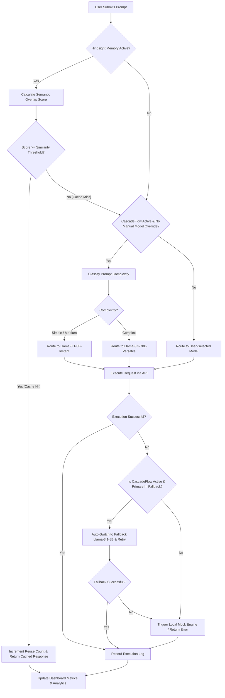

# 🧠 Medha AI - Prompt Intelligence Platform

Medha AI is a developer-centric Prompt Intelligence & LLMOps Platform designed to manage, version, optimize, and dynamically route Large Language Model (LLM) prompts. It reduces LLM operating costs and latency by combining **Hindsight Memory** (semantic caching) and **CascadeFlow Routing** (intelligent complexity-based model routing).

---

## 🚀 Key Features

*   **Hindsight Memory (Semantic Cache)**
    *   Compares incoming prompts against previous execution logs using a keyword overlap similarity algorithm.
    *   If a match exceeds the user-defined `similarityThreshold` (default `0.78`), it skips the API call entirely, serving the response from memory.
    *   **Result:** `0ms` latency and `0` token cost for repeated or highly similar queries.
*   **CascadeFlow Routing**
    *   Syntactically classifies prompt complexity (Simple, Medium, or Complex) based on length and key programmatic phrases (e.g., "write code", "optimize query", "architect").
    *   Dynamic routes prompts:
        *   **Simple/Medium:** Routed to high-speed, cost-effective models like **Llama 3.1 8B Instant**.
        *   **Complex:** Routed to maximum-intelligence models like **Llama 3.3 70B**.
    *   Maintains a manual override switch for playground experimentation.
*   **Failover Fallback System**
    *   If a primary routed model experiences a rate limit or API error, the CascadeFlow engine catches the error, downgrades the route, and retries the request using a fallback model (**Llama-3.1-8B**) to preserve application uptime.
    *   Falls back gracefully to a sandbox mock engine if the API key is missing or both routes fail.
*   **Real-time Analytics Dashboard**
    *   Displays latency curves, token counts, total spend, and average output quality scores.
    *   Calculates **Cost Savings** by comparing CascadeFlow-routed costs against a baseline of routing all requests to the most expensive model.
*   **Prompt Version Control**
    *   Tracks all edits made to prompt templates with automatic version incrementing.
    *   Provides full visual diffs and comparisons between older versions to evaluate changes.

---

## 📊 System Architecture & Flowchart

The following flowchart outlines the path an incoming prompt takes through the Medha AI execution pipeline:



---

## 🛠️ Technology Stack

*   **Frontend:** React (Vite, TypeScript), Tailwind CSS, Lucide React (Icons), Recharts (Analytics Charts).
*   **Backend:** Node.js, Express, TypeScript, Groq SDK.
*   **Database:** Light local JSON file database (`medha_store.json`) with auto-seeding capability for logs, prompts, settings, and memory caches.

---

## ⚙️ Local Installation & Setup

### Prerequisites
*   Node.js (v18+)
*   npm or yarn

### 1. Setup Environment Variables
Create a `.env` file in the root directory:
```env
PORT=5000
GROQ_API_KEY=your_groq_api_key_here
GEMINI_API_KEY=your_gemini_api_key_here
```
*(Note: A local simulation sandbox is built-in. If you do not have API keys, the server will fall back to local mock outputs to allow playground exploration).*

### 2. Install Dependencies
Install dependencies for both the frontend and backend:
```bash
# Install root (frontend) dependencies
npm install

# Install server dependencies
cd server
npm install
cd ..
```

### 3. Run the Development Servers
Open two terminal windows to run both services:

*   **Terminal 1: Start the Backend (API Server)**
    ```bash
    npm run dev:server
    ```
*   **Terminal 2: Start the Frontend App**
    ```bash
    npm run dev
    ```

Open your browser and navigate to `http://localhost:5173` to explore the Medha console.
